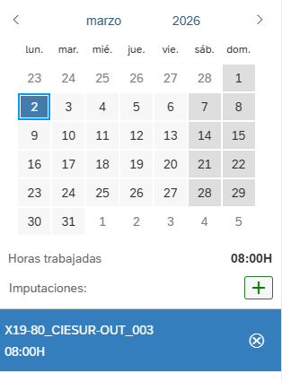

# REGISTRO RAPPORT

## DESCRIPCIÓN

Se debe registrar semanalmente en el rapport de horas.

https://intranet.seidor.es/sap/bc/ui2/flp#ZRAPPORTS_ENTRADA-display&/CopiarDias

Todos los viernes a las 8PM debo registrar las horas de la semana que ha pasado.

Ejemplo: Lunes a viernes de 8hs.

## LOGIN

INPUT LOGIN USERMAME: USERNAME_FIELD-inner
INPUT LOGIN PASSWORD: PASSWORD_FIELD-inner

BUTTON LOGIN: CLASS="sapMBtnContent sapMLabelBold sapUiSraDisplayBeforeLogin"

---

Username using .env file
Password using .env file


## Registro de horas

Mandar un POST
https://intranet.seidor.es/sap/opu/odata/sap/ZSRV_RAPP_SRV/Z_SAVE_RAP_HSet

```
:authority -> intranet.seidor.es
:method -> POST
:path -> /sap/opu/odata/sap/ZSRV_RAPP_SRV/Z_SAVE_RAP_HSet
:scheme -> https
accept -> application/json
accept-encoding -> gzip, deflate, br, zstd
accept-language -> es
content-length -> 682
content-type -> application/json
cookie sap-usercontext -> ESTO SE DEBE ADQUIRIR DESDE LA SESIÓN DE LA COOKIE
dataserviceversion -> 2.0
maxdataserviceversion -> 2.0
origin -> https://intranet.seidor.es
priority -> u=0, i
referer -> https://intranet.seidor.es/sap/bc/ui2/flp/?sap-client=100&sap-language=ES
sap-passport -> SE OBTIENE DESDE LA SESSIÓN BTENIDA
sec-ch-ua    -> "Not:A-Brand";v="99", "Brave";v="145", "Chromium";v="145"
sec-ch-ua-mobile -> ?0
sec-ch-ua-platform -> "Windows"
sec-fetch-dest -> empty
sec-fetch-mode -> cors
sec-fetch-site -> same-origin
sec-gpc -> 1
user-agent -> Mozilla/5.0 (Windows NT 10.0; Win64; x64) AppleWebKit/537.36 (KHTML, like Gecko) Chrome/145.0.0.0 Safari/537.36
x-requested-with -> XMLHttpRequest
x-xhr-logon -> accept="iframe,strict-window,window"
```

Payload:

La fecha es diaria es decir si yo registro un viernes 7 de marzo, entonces los registros cambiarian de la siguiente forma:

```
"IDatum" & "Datai1": "2026-03-01T00:00:00",
"IDatum" & "Datai1": "2026-03-02T00:00:00",
"IDatum" & "Datai1": "2026-03-03T00:00:00",
"IDatum" & "Datai1": "2026-03-04T00:00:00",
"IDatum" & "Datai1": "2026-03-05T00:00:00",
"IDatum" & "Datai1": "2026-03-06T00:00:00",
"IDatum" & "Datai1": "2026-03-07T00:00:00",
```

Es decir que registre toda la semana

```
{
    "IDatum": "2026-03-02T00:00:00",
    "IPernr": "65001734",
    "ICopy": " ",
    "Z_SAVE_RAP_R": [],
    "Z_SAVE_RAP_P": [
        {
            "Pernr": "65001734",
            "Usr": "",
            "Datai1": "2026-03-02T00:00:00",
            "Pos": "",
            "Posid": "X19-80_CIESUR-OUT_003",
            "Refint": "",
            "Subp": "",
            "Tare": "",
            "Ttar": "",
            "Divi": "",
            "Modul": "",
            "Desp": "T",
            "Situacion": "",
            "Dura": "P00DT08H00M00S",
            "Descr": "Desarrollo y análisis de migración en diferentes proyectos, pivoteo con otros clientes.",
            "Tip": "ZI",
            "Luga": "",
            "Emp": "",
            "Km": "000000",
            "Kmco": "0.0000",
            "Importkm": "0.000",
            "Auto": "0",
            "Diet": "0",
            "Avio": "0",
            "Hotel": "0",
            "Tren": "0",
            "Taxi": "0",
            "Park": "0",
            "Otros": "0",
            "Otrt": "",
            "Total": "0.00",
            "Waers": "EUR",
            "Vernr": "",
            "Verna": "",
            "Kunnr": "",
            "Name": "",
            "Modificable": ""
        }
    ]
}
```

Si todo se grabo

Debería salir así



La clase del elemento es: sapMLIBContent